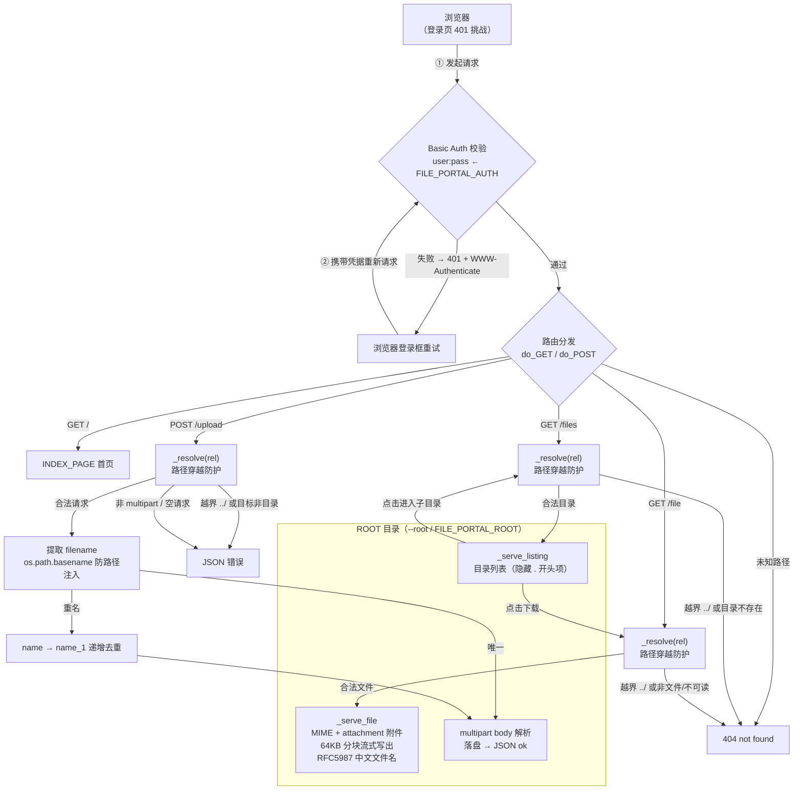

# File Portal

超轻量密码保护的个人文件管理器，单文件无依赖，`python3 file_portal.py` 即用。

## 快速开始

```bash
# 运行（仅监听 127.0.0.1）
FILE_PORTAL_AUTH="user:password" python3 file_portal.py

# 指定端口 / 暴露目录
FILE_PORTAL_PORT=8080 FILE_PORTAL_ROOT=/srv/files FILE_PORTAL_AUTH="user:password" python3 file_portal.py

# 或用命令行参数（等价）
python3 file_portal.py --port 8080 --root /srv/files --auth "user:password"
```

浏览器打开 `http://127.0.0.1:8080` 输入账号密码即可浏览 / 上传 / 下载。

> **注意**：服务默认只绑定 127.0.0.1。需要外网访问时请自行加反向代理或隧道（如 cloudflared）。  
> **务必设置强密码**——隧道是真正的攻击面，本程序只是最后一道闸。

## 外网访问（免费，链接每次会变）

默认只绑 `127.0.0.1`。用 Cloudflare Quick Tunnel 开公网 HTTPS 地址——零注册零配置、免费，**但每次重启链接都会变**：

```bash
# 装 cloudflared（GitHub releases，国内走 ghproxy/ghfast 镜像）

# 强密码起步（隧道=真实攻击面）
FILE_PORTAL_AUTH="user:password" ./scripts/portal-tunnel.sh start
# → https://xxxx-xxxx.trycloudflare.com   ← 重启即变

./scripts/portal-tunnel.sh status   # 状态
./scripts/portal-tunnel.sh url      # 看当前地址
./scripts/portal-tunnel.sh stop     # 停
```

想固定地址：升级 Cloudflare **Named Tunnel**，绑自己域名（`cloudflared tunnel login` 后指到 `files.your-domain.com`，需自有域名 + CF zone）。

## 依赖

- Python 3.8+（仅标准库，零第三方依赖）
- 无 node、无 npm、无框架

## 项目架构



路由一览：

| 方法 | 路径 | 功能 |
|---|---|---|
| GET | `/` | 首页入口 |
| GET | `/files?path=REL` | 浏览 `ROOT/REL` 目录 |
| GET | `/file?path=REL` | 下载 `ROOT/REL` 文件（附件模式） |
| POST | `/upload?path=REL` | 上传文件到 `ROOT/REL` |

路径安全：所有 `REL` 经 `_resolve()` 解析后必须落在 `ROOT` 之内，`../` 越界一律 404。

## License

[MIT](LICENSE)
